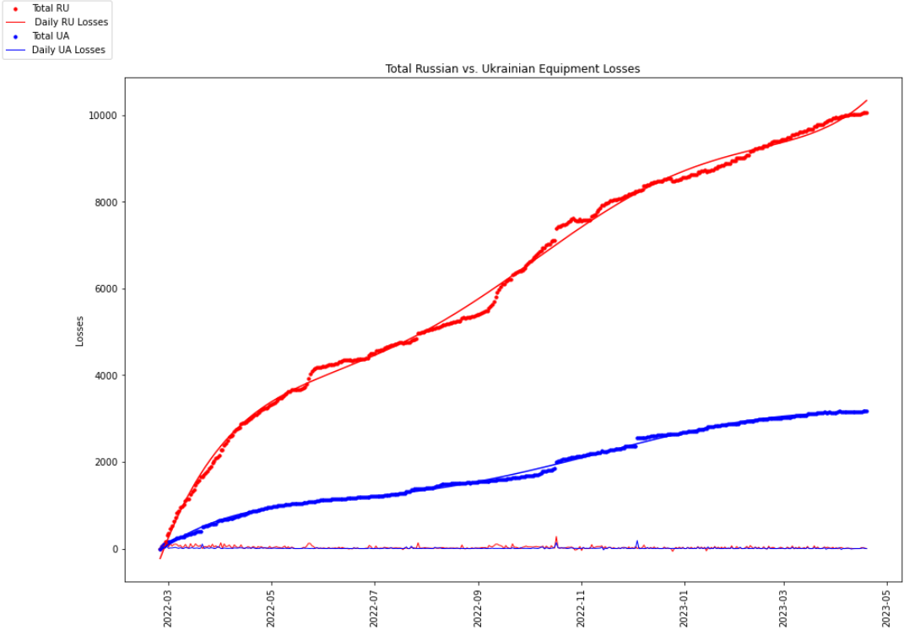
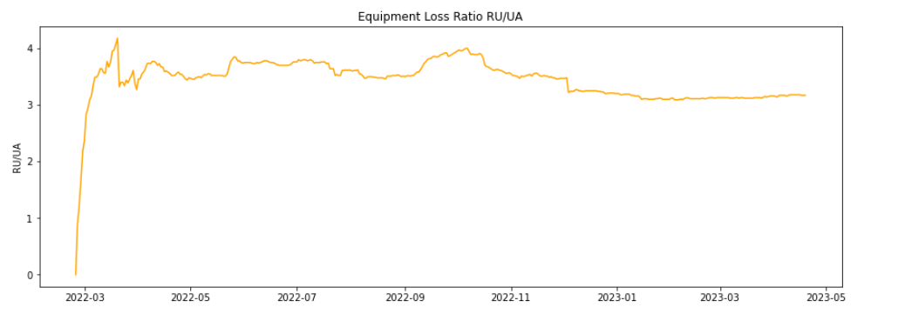
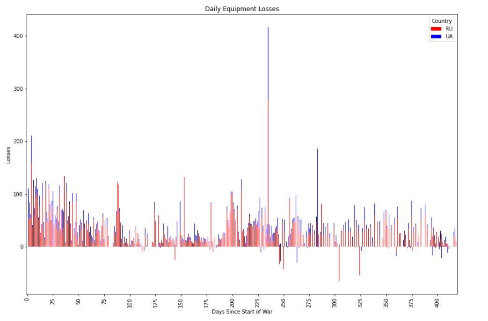
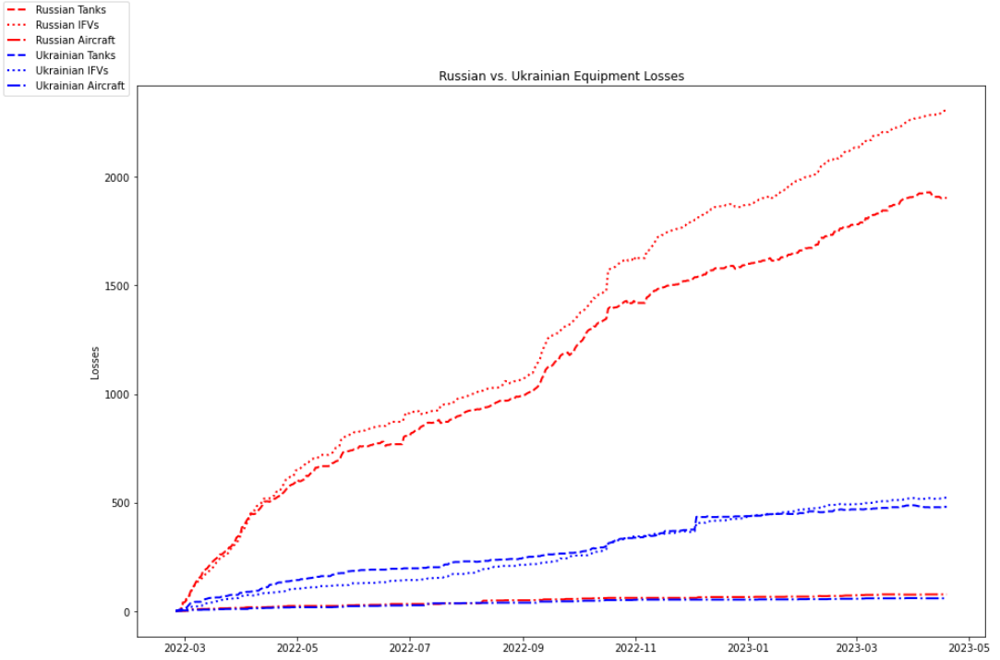
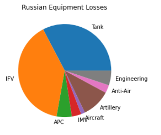
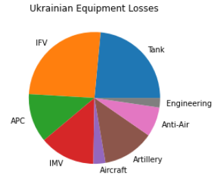
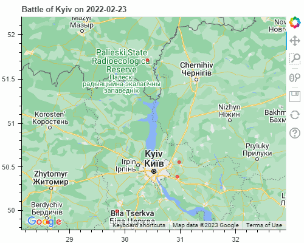
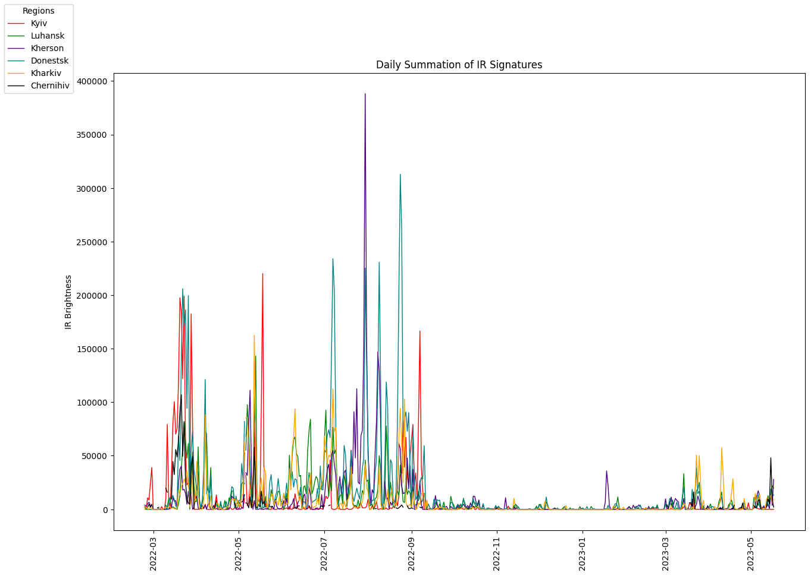

# Russia-Ukraine War
Data is pulled from this [google sheet](https://docs.google.com/spreadsheets/d/1bngHbR0YPS7XH1oSA1VxoL4R34z60SJcR3NxguZM9GI/edit#gid=0), which sources data from [Oryx's website](https://www.oryxspioenkop.com/2022/02/attack-on-europe-documenting-equipment.html). Equipment losses listed in the Oryx database are independently verified via photographic evidence; this fact causes the following data to underreport equipment losses. Further, it makes sense that the Ukrainian statistics are under reported to a higher degree due to inherent bias and less reporting in Russian controlled areas. No adjustments are made to account for this. I have made a work in progress [Tableau dashboard](https://public.tableau.com/app/profile/sam44011739/viz/Ukraine_War_Equipment/Dashboard2?publish=yes) pulling data from a static csv to play around with the data.

## Total Equipment Losses

## Relative Losses of Equipment Classifications

Perhaps the higher share of Ukrainian loss of IMVs points to their usage of asymmetric warfare, with small groups of soldiers armed with anti-tank capabilities.

## NASA FIRMS VIIRS I-Band 375m maps

